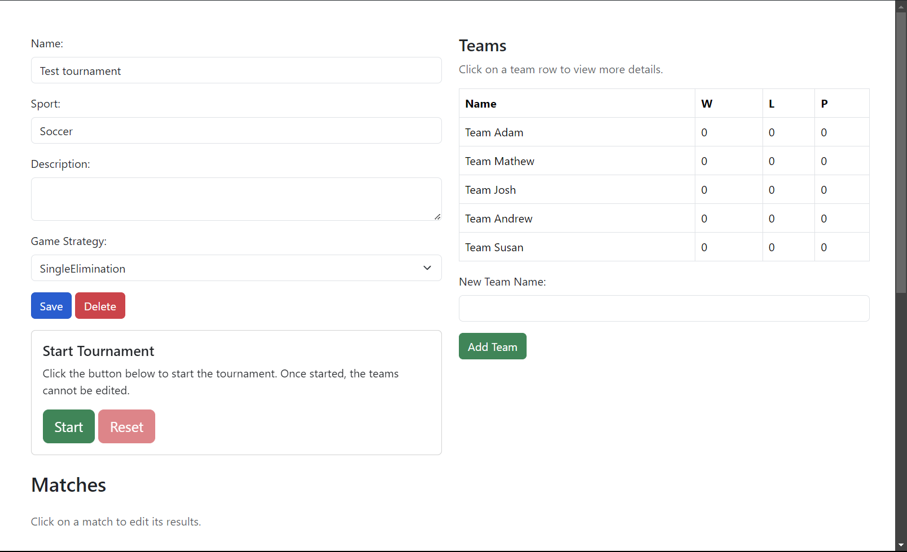

# Project for Intorduction to C#/.NET Course - Tournament Manager

This repo contains a simple web application created with Blazor, designed to help users create and manage various types of tournaments. The app allows CRUD operations on tournaments and teams, enabling users to easily track tournament progress.

## Features

- **Create, Edit, and Delete Tournaments**: Users can define the tournament name, sport type, and a description.
- **Game Strategy**: Option to select a game strategy such as Single Elimination.
- **Manage Teams**: Add teams to a tournament, edit team details, and track wins, losses, and points.
- **Manage Team Members**: Add or remove team members for each team.
- **Start and Reset Tournaments**: Start a tournament and reset if necessary.
- **View Matches**: View and edit the match details within each tournament.
- **Interactive Alerts**: SweetAlert2 is integrated for interactive and visually appealing alerts during CRUD operations and data validation.


## Technology Stack

- **Frontend**: Blazor (WebAssembly or Server)
- **Backend**: ASP.NET Core 8.0
- **Database**: SQL Server (via Entity Framework Core)
- **Alerts**: SweetAlert2 for user interaction


## Prerequisites

To run this project locally, you will need:

- .NET 8 SDK: [Download .NET 8](https://dotnet.microsoft.com/download/dotnet/8.0)
- SQL Server: [Download SQL Server](https://www.microsoft.com/en-us/sql-server/sql-server-downloads)
  
## Dependencies

This project uses the following NuGet packages:

- **[CurrieTechnologies.Razor.SweetAlert2](https://www.nuget.org/packages/CurrieTechnologies.Razor.SweetAlert2)** (v5.6.0): For displaying SweetAlert2 alerts.
- **[Microsoft.EntityFrameworkCore.SqlServer](https://www.nuget.org/packages/Microsoft.EntityFrameworkCore.SqlServer)** (v8.0.5): Entity Framework Core provider for SQL Server.
- **[Microsoft.EntityFrameworkCore.Tools](https://www.nuget.org/packages/Microsoft.EntityFrameworkCore.Tools)** (v8.0.5): Tools for Entity Framework Core, including migrations and database management.
- **[Microsoft.EntityFrameworkCore.Design](https://www.nuget.org/packages/Microsoft.EntityFrameworkCore.Design)** (v8.0.5): Design-time services for Entity Framework Core.


## Demo

### Main Page
View all current tournaments and create new ones.


### Tournament Details
CRUD operations for the selected tournament and each team.




### Strategy
Selecting a suitable game strategy and editing match results.


### Simple data validations and alerts
Alerts on data validations and CRUD operations


## Technology Stack

- **Frontend**: Blazor
- **Backend**: .NET Core

## Installation

To run this project locally:

### Install all prerequisities

- .NET 8 SDK: Download and install from here.
- LocalDB (SQL Server): LocalDB comes with Visual Studio or can be installed as part of the SQL Server Express edition. Learn more here.
1. Clone the repository
   ```bash
   git clone https://github.com/your-repo/tournament-manager.git
   ```

2. Restore Dependencies (NuGet packages)
   ```bash
   dotnet restore
   ```

3. Configure Database Connection
   The application is pre-configured to use SQL Server LocalDB, as shown in the `appsettings.json` file, You can leave this configuration as is if you're using LocalDB. Otherwise, update the connection string with your preferred database server.

4. Apply Migrations
      ```bash
   dotnet ef database update
   ```

5. Run locally on http://localhost:5000
   ```bash
   dotnet run
   ```

   